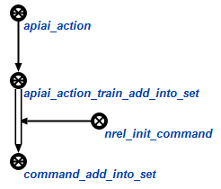
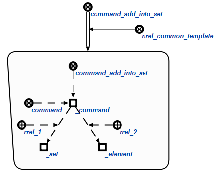
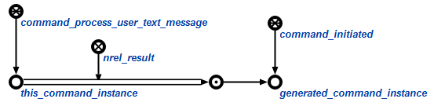
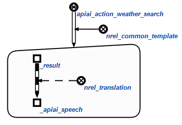
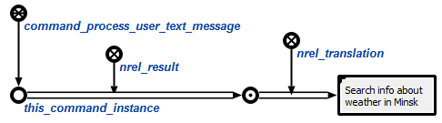

### Description

This agent trying to parse user text by using [api.ai](http://api.ai) service.
There are set `apiai_action` in the memory. This set contains all possible actions,
that can be parsed by api.ai (field `result.action` in parsed JSON).

**Note:** Name of action can contain `[0-9a-zA-Z_.]` symbols. We recomend to use
`<module>.<action_name>` rule to form action name.

After getting JSON from api.ai, agent trying to find node that represents this action
in memory. For that is replace `.` symbol by `_` in action name. And append result string
to `apiai_action_`. So new string will be look like `apiai_action_<module>_<action_name>`.

**Example:** for action `train.add_into_set` agent would try to find `sc-node` with system identifier
`apiai_action_train_add_into_set` in `apiai_action` set.

There are possible two different behaviour with found action node.

---
**Emit command**

In that case you can specify a command, that should be initiated by this apiai action.



Each command should have a common template to genarate it instance. This template
connected to command node by `nrel_common_template` relation.



**Note:** Command instance node in template should have identifier `_command`.

When command instance generated by template, then it would be added into set of
initiated commands (`command_initiated`). Also node of initiated command (`generated_command_instance`) would be
added into result set of this agent command (`this_command_instance`). See image below.



TODO: more description what going later with result

---
**Generate construction**

In that case you can specify any template that would be used to generate construction.
There are default variables that can be used in template and would be replaced by
values:

* `_apiai_speech` - value of this variable is a `sc-link` that contains text from
field `result.fullfilment.speech` in result JSON;
* `_lang` - **not implemented** values is a `sc-node` of current user used language (`lang_...`);
* `_result` - value is a result node ot this agent command instance.

For example we have result JSON:
```json
{
  "id": "d5b8d09f-ca7e-46da-a437-e8b943bee853",
  "timestamp": "2017-01-28T21:09:38.508Z",
  "result": {
    "source": "agent",
    "resolvedQuery": "weather in minsk",
    "action": "weather.search",
    "actionIncomplete": false,
    "parameters": {
      "location": "Minsk"
    },
    "contexts": [],
    "metadata": {
      "intentId": "9596c4bd-55ba-4ef2-b0b7-528026583fe2",
      "webhookUsed": "false",
      "webhookForSlotFillingUsed": "false",
      "intentName": "Weather in location"
    },
    "fulfillment": {
      "speech": "Search info about weather in Minsk",
      "messages": [
        {
          "type": 0,
          "speech": "Search info about weather in Minsk"
        }
      ]
    },
    "score": 1
  },
  "status": {
    "code": 200,
    "errorType": "success"
  },
  "sessionId": "f4ed0d4f-32d3-4edc-824f-d1ad60f498a3"
}
```

And template:



After agent finish result would be:




### Example
Example command:
```
command_process_user_text_message
  -> ...
  (*
    -> [link with text to parse];;
  *);;
```

### Result

Possible result codes:

* `sc_result_ok` - text parsed and assigned action emited;
* `sc_result_error_invalid_params` - invalid parameters for an agent (no `link`);
* `sc_result_invalid_state` - provided `link` has no content (content cant' be read);
* `sc_result_error_io` - content of a `link` can't be converted into string or can't setup speech link content;
* `sc_result_error` - can't generate and emit result action.
