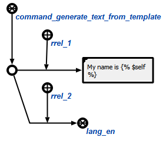
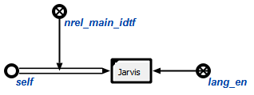

### Description

Agent generate output text, by a specified text template and input structure.

**Command class:** `command_generate_text_from_template`

**Parameters:**

1. `text template`;
2. **(optional)** `language` of output template
3. **(optional)** `input data` - structure, that would be used for output generation;
4. **(optional)** `template` to parse input data.

<div class="note">
If <code>language</code> is not specified, then agent will try to use language of <code>text template</code>
</div>

<div class="note">
Parameters <strong>3</strong> and <strong>4</strong> should be used together.
</div>

** Syntax of string template **

String template is a formatted string, that contains some keywords.
This keywords interpret by template engine depending on their semantic.
There are a list of possible keywords:
<table>
  <tr>
    <th>Keyword</th>
    <th>Description</th>
  </tr>

  <tr>
    <td>
<code class="js hljs javascript">

</code>
    </td>
    <td>This type of keyword will be replaced by main identifier of specified
        element (founded by <code>system identifier</code>). Specified as parameter
        user language will be used
        <hr/>
        <strong>Example</strong><br/>
        <code>My name is, </code><br/>
        Will produce:<br/>
        <code>My name is, Jarvis</code>, where node with system identifier
        `self` has main identifier (`nrel_main_idtf`) equal to `Jarvis`.
    </td>
  </tr>
</table>

### Example

**Example 1**

Command arguments:



Produce:

```cpp
My name is Jarvis
```

Where:



<hr/>

**Example 2**


### Result

Possible result codes:

* `sc_result_ok` - template generated;
* `sc_result_error_invalid_params` - invalid parameters for an agent. First parameter (`text template`) isn't a sc-link, or not specified. Or `input data` used without `template`;
* `sc_result_error_invalid_state` - when you use **4** or **3** parameter without another one. They should be used together;
* `sc_result_error` - internal error, that not specified.
