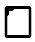
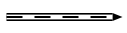
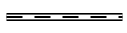
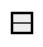
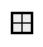
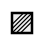

### Common

SCs-code - is a text representation of SC-code. Whole text consist of sentences, that
separated by `;;` symbols.

#### Comments
You can use C-style comments in SCs text:
```scs
// one line comment
fruit -> apple;
/* Multiline
 * comment
 */
```

#### Link to files
To make an `sc-link` into specified file you can use special type identifier:
```
"file://<file name>"
```

* `"file://<file name>"` - is a relative path to a file. According to a file, where it used;
* `"file:///<file_name>"` - is an absolute path to a file.

#### Names
There are some tricks with object names:

* `...` - is an unnamed object;
* `_<object name>` - all object names, that starts with symbol `_` represents a variable type of objects.

Objects identifier visibility. By default all objects with name `x` are visible anywhere.
After translating it into memory this object will have a **system identifier** equal to `x`.
So if you use `x` in different *scs* files, then you designate the same object in them
(would be the same element in a knowledge base).

Sometimes you need to designate the same objects in different files, but do not generate a
**system identifier** in memory for it. In this case you should to prefix it name with a `.` symbol.
For example: `.x`.

In case, when you need to make a named object just local for an *scs* file,
then you should to use `..` prefix (example: `..x`).

So a rule to build identifier is:

```
[visibility][variable]<identifier>
```

For example identifier `.._x` localy visible variable identifier.

#### Aliases

You can use alias for any sc-element by using `=` operator. There are some examples:

```scs
@file_alias = "file://...";;
@link_alias = [];;
@element_alias = element_idtf;;
@edge_alias = (c -> b);;
@alias_to_alias = @other_alias;;
```

!!! warning
    Aliases visible just in a file scope. 
    You should define alias before usage.
 
--- 

!!! note
    SCs-code is splitted into levels. Each level allows to minimize number of string symbols to represent the same structures.

### SCs level 1

SCs-code level 1 - is a simple representation of SC-code. It represents it
with just simple triples. Each triple contains `subject`, `predicate`, `object`
that are splitted by `|` symbol. Line `subject | predicate | object;;` is a sentence.

Identifier of `subject`, `predicate`, `object` build with rule:

```scs
<type>#<identifier>
```

Where `type` - is an element type specification. It can be one of possible values:

* `sc_node` - equal to ;
* `sc_link` - equal to ;
* `sc_edge_dcommon` - equal to ;
* `sc_edge_ucommon` - equal to ;
* `sc_edge_main` - equal to ;
* `sc_edge_access` - equal to .

<hr/>

**Examples**

<table>
  <tr>
    <th>SCg construction</th>
    <th>Equal SCs-level 1 text</th>
  </tr>

  <tr>
    <td><scg src="../../images/scs/scs_example_level_1.gwf"></scg></td>
    <td>
      <pre>
        <code class="js hljs javascript">
// append set of apples into fruit set
sc_node#fruit | sc_edge_main#... | sc_node#apple;;
// append set of bananas into fruit set
sc_node#fruit | sc_edge_main#... | sc_node#banana;;
        </code>
      </pre>
    </td>
  </tr>

  <tr>
    <td width="50%"><scg src="../../images/scs/scs_example_level_1_2.gwf"></scg></td>
    <td>
      <pre>
        <code class="js hljs javascript">
sc_node#apple | sc_edge_dcommon#..e | "file://apple.png";;
/*append edge from nrel_image relation into
  edge between apple set and it's image*/
sc_node#nrel_image | sc_edge_main#... | sc_edge_dcommon#..e;;
        </code>
      </pre>
    </td>
  </tr>
</table>

SCs-level 1 allows you to represent any kind of SC-code construction. It's a low-level
representation and commonly used as a transport format, that is very simple for parsing.

### SCs level 2

This level of SCs-text add two new features:

* using of extended alphabet of edges;
* using of compound identifiers of an edges.

On this level you can make sentences by rule:
```
<element> <edge> <element>;;
```

Where `<edge>` can be on of values:
<table>
  <tr>
    <th>SCs</th>
    <th>SCg equivalent</th>
  </tr>
  <tr>
    <td>`<` or `>`</td>
    <td></img></td>
  </tr>
  <tr>
    <td>`<>`</td>
    <td></img></td>
  </tr>
  <tr>
    <td>`<..` or `..>`</td>
    <td></img></td>
  </tr>
  <tr>
    <td>`<=>`</td>
    <td></img></td>
  </tr>
  <tr>
    <td>`_<=>`</td>
    <td></img></td>
  </tr>
  <tr>
    <td>`<=` or `=>`</td>
    <td></img></td>
  </tr>
  <tr>
    <td>`_<=` or `_=>`</td>
    <td></img></td>
  </tr>
  <tr>
    <td>`<-` or `->`</td>
    <td></img></td>
  </tr>
  <tr>
    <td>`_<-` or `_->`</td>
    <td></img></td>
  </tr>
  <tr>
    <td>`<|-` or `-|>`</td>
    <td></img></td>
  </tr>
  <tr>
    <td>`_<|-` or `_-|>`</td>
    <td></img></td>
  </tr>
  <tr>
    <td>`</-` or `-/>`</td>
    <td></img></td>
  </tr>
  <tr>
    <td>`_</-` or `_-/>`</td>
    <td></img></td>
  </tr>
  <tr>
    <td>`<~` or `~>`</td>
    <td></img></td>
  </tr>
  <tr>
    <td>`_<~` or `_~>`</td>
    <td></img></td>
  </tr>
  <tr>
    <td>`<|~` or `~|>`</td>
    <td></img></td>
  </tr>
  <tr>
    <td>`_<|~` or `_~|>`</td>
    <td></img></td>
  </tr>
  <tr>
    <td>`</~` or `~/>`</td>
    <td></img></td>
  </tr>
  <tr>
    <td>`_</~` or `_~/>`</td>
    <td></img></td>
  </tr>
</table>

<hr/>

<table>
  <tr>
    <th>SCg construction</th>
    <th>Equal SCs-level 2 text</th>
  </tr>

  <tr>
    <td><scg src="../../images/scs/scs_example_level_1.gwf"></scg></td>
    <td>
      <pre>
        <code class="js hljs javascript">
fruit -> apple;;
// backward direction
banana <- fruit;;
        </code>
      </pre>
    </td>
  </tr>
</table>

<hr/>
Compound identifier of an edge builds as a sentence in SCs-level 2, but without
`;;` separator and inside brackets `()`: `(<element> <edge> <element>)`.
So that allows to simplify usage of an edge as a source or target of another one.

<hr/>

**Examples**
<table>
  <tr>
    <th>SCg construction</th>
    <th>Equal SCs-level 2 text</th>
  </tr>

  <tr>
    <td width="50%"><scg src="../../images/scs/scs_example_level_1_2.gwf"></scg></td>
    <td>
      <pre>
        <code class="js hljs javascript">
nrel_image -> (fruit => "file://apple.png");;
        </code>
      </pre>
    </td>
  </tr>

  <tr>
    <td><scg src="../../images/scs/scs_example_level_2.gwf"></scg></td>
    <td>
      <pre>
        <code class="js hljs javascript">
d -> (c -> (a -> b));;
        </code>
      </pre>
    </td>
  </tr>

  <tr>
    <td><scg src="../../images/scs/scs_example_level_2_2.gwf"></scg></td>
    <td>
      <pre>
        <code class="js hljs javascript">
(a -> b) -> (c <- d);;
        </code>
      </pre>
    </td>
  </tr>

</table>

### SCs level 3

This level of SCs-text allows to minimize symbols to represent constructions like this one:
<scg src="../../images/scs/scs_example_level_3.gwf"></scg>

```scs
c -> (a -> b);;
```

To do that you should use sentence like this:

```scs
<object> <edge> <attribute>: <object>
```

For this example it would be like this:

```scs
a -> c: b;;
```

In case, when output edge from `c` is an variable, then use `::` splitter instead of `:`:

```scs
a -> c:: b;;
```

equal to:

```scs
c _-> (a -> b);;
```

<div class="note">
<b>Note</b>: you can use <code>:</code>, <code>::</code> just to replace <code>-></code> or <code>_-></code> edges.
</div>

<hr/>

**Examples**
<table>
  <tr>
    <th>SCg construction</th>
    <th>Equal SCs-level 3 text</th>
  </tr>

  <tr>
    <td><scg src="../../images/scs/scs_example_level_1_2.gwf"></scg></td>
    <td>
      <pre>
        <code class="js hljs javascript">
apple => nrel_image: "file://apple.png";;
        </code>
      </pre>
    </td>
  </tr>

  <tr>
    <td><scg src="../../images/scs/scs_example_level_3_2.gwf"></scg></td>
    <td>
      <div class="note">
        <b>Note</b>: it is possible to use any number of <code>:</code>, <code>::</code> in one sentence.
      </div>
      <pre>
        <code class="js hljs javascript">
a -> c: d:: b;;
        </code>
      </pre>
    </td>
  </tr>
</table>

### SCs level 4

This level of SCs-text allows to combine many setences with one element into one.
For that pupropses used ';' symbol. So if we have some sentences like:

```scs
x -> y;;
x <- z;;
x => h: r;;
```

Then using SCs level 4 we can write them like this:

```scs
x -> y;
  <- z;
  => h: r;;
```

Another words, this level of SCs text, allows to use source element one time.

<hr/>

**Examples**
<table>
  <tr>
    <th>SCg construction</th>
    <th>Equal SCs-level 4 text</th>
  </tr>

  <tr>
    <td><scg src="../../images/scs/scs_example_level_1.gwf"></scg></td>
    <td>
      <pre>
        <code class="js hljs javascript">
fruit -> apple;
      -> banana;;
        </code>
      </pre>
    </td>
  <tr>

  <tr>
    <td><scg src="../../images/scs/scs_example_level_4.gwf"></scg></td>
    <td>
      <pre>
        <code class="js hljs javascript">
a -> c: d: b;
  -> e;
  -> g: f;;
        </code>
      </pre>
    </td>
  </tr>
<table>

### SCs level 5

Internal sentences added to `SCs-text` on this level. They are wrapped by `(* ... *)` brackets.
This type of sentences allow to describe connections of an element inplace.
You can place these internal sentences after `object` element in triple (`subject -> object (* ... *);;`), but before `;;` separator.
You can use level `2-4` sentences inside this one. But there is a just one rule: 

!!! note ""
    You doesn't need to specify start element for each sentece. Because object (for which internal sentece builds) is going to be a subject for all internal sentences 

Look at the examples, to understand how it works:


<table>
  <tr>
    <th>SCs-level 2-4</th>
    <th>SCs-level 5</th>
    <th>Description</th>
  </tr>
  
  <tr>
    <td>
      <pre><code class="js hljs javascript">
set -> attr: item;;
item -> subitem;;
        </code></pre>
    </td>
    <td>
      <pre><code class="js hljs javascript">
set
  -> attr: item 
    (*
      -> subitem;;
    *);;
      </code></pre>
    </td>
    <td>
    This is a simple example, that allow to make an <code>SCs-text</code> more readable and useful. In this case text has a sublevels, that allow 
    to read it faster.
    </td>
  </tr>

  <tr>
    <td>
      <pre>
        <code class="js hljs javascript">
set -> attr: item;;
item -> subitem;;
item -> attr2: subitem2;;
        </code>
      </pre>
    </td>
    <td>
      <pre>
        <code class="js hljs javascript">
set 
  -> attr: item
  (* 
    -> subitem;;
    -> attr2:
      subitem2;;
  *);;
        </code>
      </pre>
    </td>
    <td>
    You can use as more as you need sentences in <code>(* *)</code>, but all of them should be separated by <code>;;</code>.
    </td>
  </tr>

  <tr>
    <td>
      <pre><code class="js hljs javascript">
@en_idtf = [sc-element];;
@ru_idtf = [sc-элемент];;
@en_idtf <- lang_en;;
@ru_idtf <- lang_ru;;
sc_element 
  => nrel_main_idtf: 
    @en_idtf;
    @ru_idtf;;
      </code></pre>
    </td>
    <td>
      <pre><code class="js hljs javascript">
sc_element
  => nrel_main_idtf:
    [sc-element]
    (* <- lang_en;; *);
  => nrel_main_idtf:
    [sc-элемент]
    (* <- lang_ru;; *);;
        </code></pre>
    </td>
    <td>
    This type of syntax is very useful, when you need to specify some meta information on <code>sc-link</code>'s.
    In this example we specify two main identifiers for a <code>sc_element</code>. One is an english (<code>lang_en</code>) identifier,
    another one is a russian (<code>lang_ru</code>).
    </td>
  </tr>
  
</table>

### SCs level 6

There are some new complex aliases, that adds by this level of `SCs-text`:

* `[...]` - this is a short representation of `sc-link` with a content. You can create `sc-link` with a specified content
by using this feature. There are all possible cases:
<table>
  <tr>
    <th>Type</th>
    <th>Description</th>
    <th>Example</th>
  </tr>
    <tr>
      <td>`string`</td>
      <td>You can write any string that you wish inside <code>[ ... ]</code> alias</td>
      <td>
        <pre><code class="js hljs javascript">
x -> [any string];;
x -> [this is a 
 multiline text];;
        </code></pre>
      </td>
    </tr>
    <tr>
      <td>`number`</td>
      <td>You can specify a number as a binary data. To do that, just use syntax:
        <code>[^"type: value"]</code>. Where <code>type</code> is a one of possible types:
        <ul> 
          <li><code>int</code> - signed integer value (32 bit). You can also use such types for an integer:
            <code>int8</code>, <code>int16</code>, <code>int32</code>, <code>int64</code>
          </li>
          <li><code>uint</code> - unsigned integer value (32 bit). You can also use such type for an unsigned integer:
            <code>uint8</code>, <code>uint16</code>, <code>uint32</code>, <code>uint64</code>
          </li>
          <li><code>float</code> - 32-bit float value</li>
          <li><code>double</code> - 64-bit float value</li>
        </ul>
      </td>
      <td>
        <pre><code class="js hljs javascript">
x -> [^"float: 435.2346"];;
x -> [^"int8: 7"];;
x -> [^"uint: 781236"];;
        </code></pre>
      </td>
    </tr>
</table>

* `[* ... *]` this is a short representation of <code>sc-structure</code>. You can use just <code>SCs-text</code> inside this brackets.
  So these brackets will designate an <code>sc-structure</code> (<code>sc-node</code> with a type <code>sc_node_struct</code>). All elements inside
  brackets will have ingoing edge (type <code>sc_edge_main</code>) from that <code>sc-node</code>.
  <table>
    <tr>
      <th>SCs-text level 2-5</th>
      <th>SCs-text level 6</th>
    </tr>

    <tr>
      <td>
        <pre><code class="js hljs javascript">
@edge_alias = (set -> item);;
struct -> set; item; @edge_alias;;
        </code></pre>
      </td>
      <td>
        <pre><code class="js hljs javascript">
@struct = [ set -> item;; ];;
        </code></pre>
      </td>
    </tr>
  </table>

!!! important "Thats important"
    `SCs-text` inside `[* ... *]` has the same rules and semantic, like it was be in a separated file

* `{ ... }` this is a short representation of set. This feature allow to make sets in very fast way.
  Syntax looks like:
  
  ```scs
  @set = {
    element1;
    attr2: element2;
    ...
    last_element // no semicolon after last element
  }
  ```

<table>
  <tr>
    <th>SCs-text level 2-5</th>
    <th>SCs-text level 6</th>
    <th>Comments</th>
  </tr>

  <tr>
    <td>
      <pre><code class="js hljs javascript">
set
  <- sc_node_tuple;
  -> element1;
  -> attr2: element2;
  -> element3;;
      </code></pre>
    </td>
    <td>
      <pre><code class="js hljs javascript">
@set = {
  element1;
  attr2: element2;
  element3 // no semicolon
};;
      </code></pre>
    </td>
    <td>Using set looks much cleaner. You can use even attributes on it</td>
  </tr>
  
  <tr>
    <td>
      <pre><code class="js hljs javascript">
meta_set 
  <- sc_node_tuple;
  -> set1;
  -> set2;;

set1
  <- sc_node_tuple;
  -> element1;
  -> attr2: element2;
  -> element3;;

set2
  <- sc_node_tuple;
  -> element5;
  -> element6;;

set3
  <- sc_node_tuple;
  -> element10;;

element 
  => nrel_relation:
    set3;;
      </code></pre>
    </td>
    <td>
      <pre><code class="js hljs javascript">
@meta_set = {
  {
    element1;
    attr2: element2;
    element3
  };
  {
    element5;
    element6
  }
};;

element 
  => nrel_relation:
  {
    element10
  };;
      </code></pre>
    </td>
    <td>You can use set alias inside any other complex aliases and triples.</td>
  </tr>
</table>


### Keynodes

There are a list of element type keynodes, that can be used to specify type of an element:

| Keynode                           | Equal sc-type                       | Equal SCg-element
| --------------------------------- | ----------------------------------- | --------------
| sc_node                           | ScType::Node                        | 
| sc_link                           | ScType::Link                        | 
| sc_edge_dcommon                   | ScType::EdgeDCommon                 | 
| sc_edge_ucommon                   | ScType::EdgeUCommon                 | 
| sc_edge_main                      | ScType::EdgeAccessConstPosPerm      | 
| sc_edge_access                    | ScType::EdgeAccess                  | 
| sc_node_tuple                     | ScType::NodeTuple                   |  
| sc_node_struct                    | ScType::NodeStruct                  |  
| sc_node_role_relation             | ScType::NodeRole                    |  
| sc_node_norole_relation           | ScType::NodeNoRole                  |  
| sc_node_class                     | ScType::NodeClass                   |  
| sc_node_abstract                  | ScType::NodeAbstract                |  
| sc_node_material                  | ScType::NodeMaterial                |  

There are old keynodes, that used for backward compatibility:

| Keynode                   | Equal sc-type | New keynode |
| ------------------------- | ------------- | ----------- |
| sc_arc_main               | ScType::EdgeAccessConstPosPerm | sc_edge_main |
| sc_edge                   | ScType::EdgeUCommon | sc_edge_ucommon |
| sc_arc_common             | ScType::EdgeDCommon | sc_edge_dcommon |
| sc_arc_access             | ScType::EdgeAccess  | sc_edge_access |
| sc_node_not_relation      | ScType::NodeClass | sc_node_class |
| sc_node_not_binary_tuple  | ScType::NodeTuple | sc_node_tuple |

There is an example of usage:

<table>
  <tr>
    <th>SCs-code</th>
    <th>Equal SCg-code</th>
  </tr>
  <tr>
    <td>
      <pre>
a <- sc_node_class;;
a _-> _b;;
_b <- sc_node_material;;
      </pre>
    </td>
    <td><scg src="../images/scs_keynodes_old_example_1.gwf"></scg></td>
  </tr>
  <tr>
    <td>
      <pre>
_x => nrel_y: t;;
nrel_y <- sc_node_norole_relation;;
      </pre>
    </td>
    <td><scg src="../images/scs_keynodes_old_example_2.gwf"></scg></td>
  </tr>
</table>