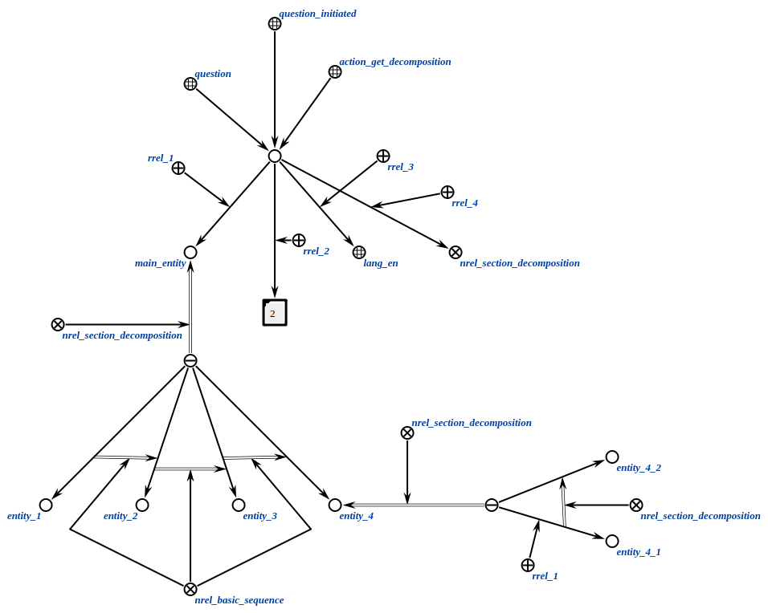
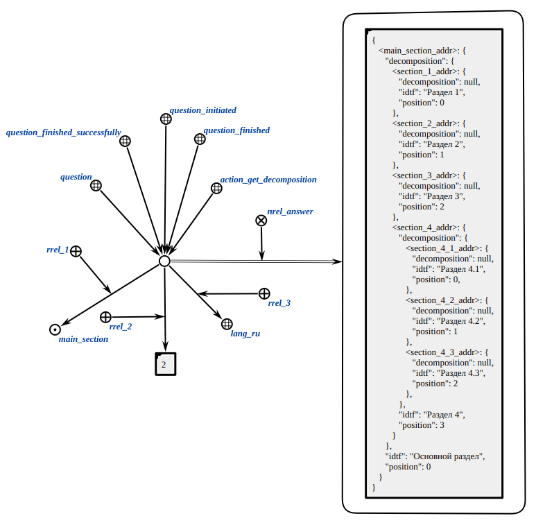

## ScAgent Implementations

### Get Decomposition Agent

It is an agent that get decomposition of subject domain in JSON format

**Action class:**

`action_get_decomposition`

**Parameters:**

1. `subjDomain` - subject domain node;
1. `level` - link that stores decomposition level (unnecessary parameter, by default value of `level` parameter is `1`);
1. `lang` - language node;
1. `relation of decomposition` - relation node by which an entity is decomposed.

**Example:**

Example of an input structure:

</img>

Example of an output structure:

</img>

**Result:**

* `SC_RESULT_OK` - result link is generated.
* `SC_RESULT_ERROR` - internal error in the link generation.
* `SC_RESULT_ERROR_INVALID_PARAMS` - internal error. This happens when subject domain node is invalid.
