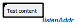

Knowledge processing machine (KPM) - is a set of modules. Each module contains implementation of sc-agents. Also they can contains any other functions and classes, than used by sc-agents implementation.

## ScModule

Module - is a dynamic library. That implement specified module class.
To create module you need to do next steps:

 1. Create directory for your module in sc-kpm. For example: `sc-kpm/nl`;
 2. Go to created directory;
 3. Create file `CMakeLists.txt` with content (replace nl (module name) to yours one:

**CMakeLists.txt**
```bash
set(SC_IOT_SRC ${CMAKE_CURRENT_LIST_DIR})

set(SOURCES
	"nl.cpp"
)
set(HEADERS
	"nl.hpp"
)

include_directories(${SC_IOT_SRC} ${SC_MEMORY_SRC})

add_library (nl SHARED ${SOURCES} ${HEADERS})
add_dependencies(nl sc-memory-cpp)
target_link_libraries(nl sc-memory-cpp)

sc_codegen(nl ${SC_IOT_SRC})
```

After that you need to create two files (cpp, hpp):

**nl.hpp**

```cpp
#pragma once

#include <sc-memory/cpp/sc_module.hpp>

#include "nl.generated.hpp"

class nlModule : public ScModule
{
  SC_CLASS(LoadOrder(11))
  SC_GENERATED_BODY()

  virtual sc_result InitializeImpl() override;
  virtual sc_result ShutdownImpl() override;
};
```

**nl.cpp**

```cpp
#include "nl.hpp"

SC_IMPLEMENT_MODULE(nlModule)

sc_result nlModule::InitializeImpl()
{
  return SC_RESULT_OK;
}

sc_result nlModule::ShutdownImpl()
{
  return SC_RESULT_OK;
}
```

## ScAgent

To create sc-agent implementation you need:

1. create source and header file for sc-agent implementation
2. add created files into `CMakeLists.txt`

**CMakeLists.txt**
```bash
...

set(SOURCES
  "nl.cpp"
  "nlApiAi.cpp"
)
set(HEADERS
  "nl.hpp"
  "nlApiAi.hpp"
)

...
```

**nlApiAi.hpp**
```cpp
#pragma once

#include "wrap/kpm/sc_agent.hpp"
#include "nlApiAi.generated.hpp"

namespace nl
{
  class AApiAiParseUserTextAgent : public ScAgentAction
  {
    SC_CLASS(Agent, CmdClass("command_process_user_text_message"))
    SC_GENERATED_BODY()
  };
}
```

**nlApiAi.cpp**
```cpp
#include "nlApiAi.hpp"

namespace nl
{
  SC_AGENT_ACTION_IMPLEMENTATION(AApiAiParseUserTextAgent)
  {
    // implement agent logic there
    return SC_RESULT_ERROR;
  }
}
```

**SC_AGENT_ACTION_IMPLEMENTATION** - is a macros that insert generated code an minimize work. You just insert this one (with class name as parameter), and implement it like a function. During implementation you can use such variables:
* `requestAddr` - `ScAddr` of command (action) instance that was initiated;
* `resultAddr` - `ScAddr` of sc-structure that designate command (action) result;
* `mMemoryCtx` - memory context that can be used to work with `ScMemory`.

If sc-agent finished work without any errors, then it must return `SC_RESULT_OK`, otherwise - one of code error `SC_RESULT_ERROR_...`.
Result of agent will be automaticaly added into specified set:

<scg src="../images/sc_result_ok_example.gwf"></scg>

Possible result sets:

* `sc_result_error` - unknown error;
* `sc_result_ok` - no any errors (successfull finish);
* `sc_result_error_invalid_params` - invalid parameters of agent;
* `sc_result_error_invalid_type` - invalid type error (invalid type of data of something else);
* `sc_result_error_io` - input/output error (can't read/write something from/to any source);
* `sc_result_invalid_state` - invalid state of processing data;
* `sc_result_error_not_found` - something wasn't found (for example: can't resolve element by identifier);
* `sc_result_error_no_write_rights` - agent hasn't rights to write something;
* `sc_result_error_no_read_rights` - agent hans't rights to read something.


**It's important:**

* All sc-agents class names must to be started with A symbol;
* You can implement more than one `ScAgent` class in on source/header file;
* Don't use any other memory contexts instead of `mMemoryCtx` in `ScAgent` implementation;
* You need always include `<you_header>.generated.hpp` file into your header, if you have any metadata. This include must be a last one in a file.

## ScEvent
This type of objects allows you to subscribe to any events in `ScMemory`. There are c++ classes that correspond to specified event types:

* `ScEventAddOutputEdge` - emits each time, when output (outgoing) edge (from specified element) added;
* `ScEventAddInputEdge` - emits each time, when input (ingoing) edge (into specified element) added;
* `ScEventRemoveOutputEdge` - emits each time, when output (outgoing) edge (from specified element) removed;
* `ScEventRemoveInputEdge` - emits each time, when input (ingoing) edge (into specified element) removed;
* `ScEventEraseElement` - emits, when specified element removed;
* `ScEventContentChanged` - emits each time, when content of specified sc-link changed.

Each event constructor takes 3 parameters:

* `ctx` - `ScMemoryContext` that will be used to work with event;
* `addr` - `ScAddr` of element that need to be listen for a specified event;
* `func` - delegate to a callback function, that will be called on each event emit (`bool func(ScAddr const & listenAddr, ScAddr const & edgeAddr, ScAddr const & otherAddr)`). Description of parameters for this function you can see in table below (for each event type). **Note: callback function will be called in another thread!**

Table of description (parameters of callback function named on pictures, if there are no parameter name on picture, then it's would have an empty value):
<table width="95%">
  <tr>
    <th>Class</th>
    <th>Description</th>
  </tr>

  <tr>
    <td><strong>ScEventAddOutputEdge</strong></td>
    <td>
      <scg src="../../images/sc-events/sc-event-output-edge.gwf"></scg>
      <br/>
      Callback calls each time, when any type edge <code>edgeAddr</code> between <code>listenAddr</code> and <code>otherAddr</code> create.
      <hr/>
      <strong>Example C++ code</strong>:
      <pre><code class="cpp hljs">
auto const callback [](ScAddr const & listenAddr,
                       ScAddr const & edgeAddr,
                       ScAddr const & otherAddr)
{
    // listenAddr - ScAddr of source element
    //  (listen it in event)
    // edgeAddr - ScAddr of added output edge
    // otherAddr - target element of added edge
    ...
    return true; // if failed, then return false
};
ScEventAddOutputEdge evt(ctx, addr, callback);
      </code><pre>
    </td>
  </tr>

  <tr>
    <td><strong>ScEventAddInputEdge</strong></td>
    <td>
      <scg src="../../images/sc-events/sc-event-input-edge.gwf"></scg>
      <br/>
      Callback calls each time, when any type edge <code>edgeAddr</code> between <code>otherAddr</code> and <code>listenAddr</code> create.
      <hr/>
      <strong>Example C++ code</strong>:
      <pre><code class="cpp hljs">
auto const callback [](ScAddr const & listenAddr,
                       ScAddr const & edgeAddr,
                       ScAddr const & otherAddr)
{
    // listenAddr - ScAddr of target element
    //  (listen it in event)
    // edgeAddr - ScAddr of added input edge
    // otherAddr - source element of added edge
    ...
    return true; // if failed, then return false
};
ScEventAddInputEdge evt(ctx, addr, callback);
      </code></pre>
    </td>
  </tr>

  <tr>
    <td><strong>ScEventRemoveOutputEdge</strong></td>
    <td>
      <scg src="../../images/sc-events/sc-event-output-edge.gwf"></scg>
      <br/>
      Callback calls each time, when any type edge <code>edgeAddr</code> between <code>listenAddr</code> and any element <code>otherAddr</code> erase.
      <hr/>
      <strong>Example C++ code</strong>:
      <pre><code class="cpp hljs">
auto const callback [](ScAddr const & listenAddr,
                       ScAddr const & edgeAddr,
                       ScAddr const & otherAddr)
{
    // listenAddr - ScAddr of source element
    //  (listen it in event)
    // edgeAddr - ScAddr of erased output edge
    // otherAddr - target element of erased edge
    ...
    return true; // if failed, then return false
};
ScEventRemoveOutputEdge evt(ctx, addr, callback);
      </code></pre>
    </td>
  </tr>

  <tr>
    <td><strong>ScEventRemoveInputEdge</strong></td>
    <td>
      <scg src="../../images/sc-events/sc-event-input-edge.gwf"></scg>
      <br/>
      Callback calls each time, when any type edge <code>edgeAddr</code> between any element <code>otherAddr</code> and <code>listenAddr</code> erase.
      <hr/>
      <strong>Example C++ code</strong>:
      <pre><code class="cpp hljs">
auto const callback [](ScAddr const & listenAddr,
                       ScAddr const & edgeAddr,
                       ScAddr const & otherAddr)
{
    // listenAddr - ScAddr of target element
    //  (listen it in event)
    // edgeAddr - ScAddr of erased input edge
    // otherAddr - source element of erased edge
    ...
    return true; // if failed, then return false
};
ScEventRemoveOutputEdge evt(ctx, addr, callback);
      </code></pre>
    </td>
  </tr>

  <tr>
    <td><strong>ScEventEraseElement</strong></td>
    <td>
    Callback calls when <code>listenAddr</code> erased.
    <hr/>
    <strong>Example C++ code</strong>:
    <pre><code class="cpp">
auto const callback [](ScAddr const & listenAddr,
                       ScAddr const & edgeAddr,
                       ScAddr const & otherAddr)
{
  // listenAddr - ScAddr of erased element
  //  (listen it in event)
  // edgeAddr - empty
  // otherAddr - empty
  ...
  return true; // if failed, then return false
};
ScEventEraseElement evt(ctx, addr, callback);
    </code></pre>
    </td>
  </tr>

  <tr>
    <td><strong>ScEventContentChanged</strong></td>
    <td>
      </img>
      <br/>
      Callback calls when content of <code>listenAddr</code> changed.
      <hr/>
      <strong>Example C++ code</strong>:
      <pre><code class="cpp">
auto const callback [](ScAddr const & listenAddr,
                       ScAddr const & edgeAddr,
                       ScAddr const & otherAddr)
{
  // listenAddr - ScAddr of element that has
  //     content changed (listen it in event)
  // edgeAddr - empty
  // otherAddr - empty
  ...
  return true; // if failed, then return false
};
ScEventContentChanged evt(ctx, addr, callback);
      </code></pre>
    </td>
  </tr>
</table>

## ScWait
This type of objects used to wait until some event emits. It usually used, when on of an `ScAgent` want to wait result of another one. There are next kind of `ScWait` objects:

* `ScWait`- lock run flow until simple event emits. You can see the list of this events in the Class propertires table (Event property);
* `ScWaitCondition` - lock run flow until simple event emits and specified conditional check returns true. Another words, this works like an `ScWait`, but returns to run flow if special condition function returns true. Condition function receive 3 parameters (see [ScEvent](#scevent) for more details about them);
* `ScWaitConstruction` - wait object, that wait until specified construction would be appeared in a memory. **(Not implemented yet)**

There are some examples of usage for specified `ScWait` objects:

**Wait input edge into addr**
```cpp
ScWait<ScEventAddInputEdge> waiter(ctx, addr);
waiter.Wait();
```

**Wait input edge into addr, with condition**
```cpp
auto check = [](ScAddr const & listenAddr,
                ScAddr const & edgeAddr,
                ScAddr const & otherAddr)
{
  ... // check condition there
  return false; // return true or false depending on condition
};
ScWaitCondition<ScEventAddInputEdge> waiter(ctx, addr, SC_WAIT_CHECK(check));
waiter.Wait();
```

There are some preimplemented most common waiters:
* `ScWaitActionFinished` - wait until specified `command` will be finished. Example:
```cpp
...
ScWaitActionFinished waiter(ctx, commandAddr);
waiter.Wait();
...
```
