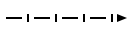
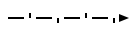

<table>
  <tr>
    <th>Graphical (SCg)</th>
    <th>C</th>
    <th>C++</th>
    <th>SCs</th>
    <th>10</th>
    <th>16</th>
  </tr>

  <tr>
    <td></img></td>
    <td>sc_type_node</td>
    <td>ScType::Node</td>
    <td>sc_node</td>
    <td>1</td>
    <td>0x1</td>
  </tr>

  <tr>
    <td></img></td>
    <td>sc_type_node | sc_type_const</td>
    <td>ScType::NodeConst</td>
    <td></td>
    <td>32</td>
    <td>0x20</td>
  </tr>

  <tr>
    <td></img></td>
    <td>sc_type_node | sc_type_var</td>
    <td>ScType::NodeVar</td>
    <td></td>
    <td>64</td>
    <td>0x40</td>
  </tr>

  <tr>
    <td></td>
    <td>sc_type_node | sc_type_node_tuple</td>
    <td>ScType::NodeTuple</td>
    <td>sc_node_tuple</td>
    <td>128</td>
    <td>0x80</td>
  </tr>

  <tr>
    <td></img></td>
    <td>sc_type_node | sc_type_const | sc_type_node_tuple</td>
    <td>ScType::NodeConstTuple</td>
    <td>sc_node_tuple   sc_node_not_binary_tuple</td>
    <td>160</td>
    <td>0xA0</td>
  </tr>

  <tr>
    <td></img></td>
    <td>sc_type_node | sc_type_var | sc_type_node_tuple</td>
    <td>ScType::NodeVarTuple</td>
    <td></td>
    <td>192</td>
    <td>0xC0</td>
  </tr>

  <tr>
    <td></td>
    <td>sc_type_node_struct | sc_type_node</td>
    <td>ScType::NodeStruct</td>
    <td>sc_node_struct</td>
    <td>256</td>
    <td>0x100</td>
  </tr>

  <tr>
    <td></img></td>
    <td>sc_type_node | sc_type_const | sc_type_node_struct</td>
    <td>ScType::NodeConstStruct</td>
    <td>sc_node_struct</td>
    <td>288</td>
    <td>0x120</td>
  </tr>

  <tr>
    <td></img></td>
    <td>sc_type_node | sc_type_var | sc_type_node_struct</td>
    <td>ScType::NodeVarStruct</td>
    <td></td>
    <td>320</td>
    <td>0x140</td>
  </tr>

  <tr>
    <td></td>
    <td>sc_type_node | sc_type_node_role</td>
    <td>ScType::NodeRole</td>
    <td>sc_node_role_relation</td>
    <td>512</td>
    <td>0x200</td>
  </tr>

  <tr>
    <td></img></td>
    <td>sc_type_node | sc_type_const | sc_type_node_role</td>
    <td>ScType::NodeConstRole</td>
    <td>sc_node_role_relation</td>
    <td>544</td>
    <td>0x220</td>
  </tr>

  <tr>
    <td></img></td>
    <td>sc_type_node | sc_type_var | sc_type_node_role</td>
    <td>ScType::NodeVarRole</td>
    <td></td>
    <td>576</td>
    <td>0x240</td>
  </tr>

  <tr>
    <td></td>
    <td>sc_type_node | sc_type_node_norole</td>
    <td>ScType::NodeNorole</td>
    <td>sc_node_norole_relation</td>
    <td>1024</td>
    <td>0x400</td>
  </tr>

  <tr>
    <td></img></td>
    <td>sc_type_node | sc_type_const | sc_type_node_norole</td>
    <td>ScType::NodeConstNorole</td>
    <td>sc_node_norole_relation</td>
    <td>1056</td>
    <td>0x420</td>
  </tr>

  <tr>
    <td></img></td>
    <td>sc_type_node | sc_type_var | sc_type_node_norole</td>
    <td>ScType::NodeVarNorole</td>
    <td></td>
    <td>1088</td>
    <td>0x440</td>
  </tr>

  <tr>
    <td></td>
    <td>sc_type_node | sc_type_node_class</td>
    <td>ScType::NodeClass</td>
    <td>sc_node_class</td>
    <td>2048</td>
    <td>0x800</td>
  </tr>

  <tr>
    <td></img></td>
    <td>sc_type_node | sc_type_const | sc_type_node_class</td>
    <td>ScType::NodeConstClass</td>
    <td>sc_node_class   sc_node_not_relation</td>
    <td>2080</td>
    <td>0x820</td>
  </tr>

  <tr>
    <td></img></td>
    <td>sc_type_node | sc_type_var | sc_type_node_class</td>
    <td>ScType::NodeVarClass</td>
    <td></td>
    <td>2112</td>
    <td>0x840</td>
  </tr>

  <tr>
    <td></td>
    <td>sc_type_node | sc_type_node_material</td>
    <td>ScType::NodeMaterial</td>
    <td>sc_node_material</td>
    <td>8192</td>
    <td>0x2000</td>
  </tr>

  <tr>
    <td></img></td>
    <td>sc_type_node | sc_type_const | sc_type_node_material</td>
    <td>ScType::NodeConstMaterial</td>
    <td>sc_node_material</td>
    <td>8224</td>
    <td>0x2020</td>
  </tr>

  <tr>
    <td></img></td>
    <td>sc_type_node | sc_type_var | sc_type_node_material</td>
    <td>ScType::NodeVarMaterial</td>
    <td></td>
    <td>8256</td>
    <td>0x2040</td>
  </tr>

  <tr>
    <td></img></td>
    <td>sc_type_link_const</td>
    <td>ScType::Link</td>
    <td>sc_link</td>
    <td>34</td>
    <td>0x22</td>
  </tr>

  <tr>
    <td></img></td>
    <td>sc_type_link_var</td>
    <td>ScType::LinkVar</td>
    <td>sc_link_var</td>
    <td>66</td>
    <td>0x42</td>
  </tr>

  <tr>
    <td></img></td>
    <td>sc_type_edge_common</td>
    <td>ScType::EdgeUCommon</td>
    <td>sc_edge sc_edge_ucommon <></td>
    <td>4</td>
    <td>0x04</td>
  </tr>

  <tr>
    <td></img></td>
    <td>sc_type_arc_common</td>
    <td>ScType::EdgeDCommon</td>
    <td>sc_arc_common   sc_edge_common   <   ></td>
    <td>8</td>
    <td>0x08</td>
  </tr>

  <tr>
    <td></img></td>
    <td>sc_type_edge_common | sc_type_const</td>
    <td>ScType::EdgeUCommonConst</td>
    <td><=></td>
    <td>36</td>
    <td>0x24</td>
  </tr>

  <tr>
    <td></img></td>
    <td>sc_type_edge_common | sc_type_var</td>
    <td>ScType::EdgeUCommonVar</td>
    <td>_<=></td>
    <td>68</td>
    <td>0x44</td>
  </tr>

  <tr>
    <td></img></td>
    <td>sc_type_arc_common | sc_type_const</td>
    <td>ScType::EdgeDCommonConst</td>
    <td>=>   <=</td>
    <td>40</td>
    <td>0x28</td>
  </tr>

  <tr>
    <td></img></td>
    <td>sc_type_arc_common | sc_type_var</td>
    <td>ScType::EdgeDCommonVar</td>
    <td>_<=   <=_   _=></td>
    <td>72</td>
    <td>0x48</td>
  </tr>

  <tr>
    <td></img></td>
    <td>sc_type_arc_access</td>
    <td>ScType::EdgeAccess</td>
    <td>sc_arc_access   sc_edge_access   ..>   <.. </td>
    <td>16</td>
    <td>0x10</td>
  </tr>

  <tr>
    <td></img></td>
    <td>sc_type_arc_access | sc_type_const | sc_type_arc_pos | sc_type_arc_perm</td>
    <td>ScType::EdgeAccessConstPosPerm</td>
    <td>sc_arc_main   sc_edge_main   <-   -></td>
    <td>2224</td>
    <td>0x8B0</td>
  </tr>

  <tr>
    <td></img></td>
    <td>sc_type_arc_access | sc_type_var | sc_type_arc_pos | sc_type_arc_perm</td>
    <td>ScType::EdgeAccessVarPosPerm</td>
    <td>_<-   _->   <-_</td>
    <td>2256</td>
    <td>0x8D0</td>
  </tr>

  <tr>
    <td></img></td>
    <td>sc_type_arc_access | sc_type_const | sc_type_arc_neg | sc_type_arc_perm</td>
    <td>ScType::EdgeAccessConstNegPerm</td>
    <td><|-   -|></td>
    <td>2352</td>
    <td>0x930</td>
  </tr>

  <tr>
    <td></img></td>
    <td>sc_type_arc_access | sc_type_var | sc_type_arc_neg | sc_type_arc_perm</td>
    <td>ScType::EdgeAccessVarNegPerm</td>
    <td>_<|-   _-|>   <|-_</td>
    <td>2384</td>
    <td>0x950</td>
  </tr>

  <tr>
    <td></img></td>
    <td>sc_type_arc_access | sc_type_const | sc_type_arc_fuz | sc_type_arc_perm</td>
    <td>ScType::EdgeAccessConstFuzPerm</td>
    <td><<i></i>/-   -/></td>
    <td>2608</td>
    <td>0xA30</td>
  </tr>

  <tr>
    <td></img></td>
    <td>sc_type_arc_access | sc_type_var | sc_type_arc_fuz | sc_type_arc_perm</td>
    <td>ScType::EdgeAccessVarFuzPerm</td>
    <td>_<<i></i>/- _-/> <<i></i>/-_</td>
    <td>2640</td>
    <td>0xA50</td>
  </tr>

  <tr>
    <td></img></td>
    <td>sc_type_arc_access | sc_type_const | sc_type_arc_pos | sc_type_arc_temp</td>
    <td>ScType::EdgeAccessConstPosTemp</td>
    <td><~   ~></td>
    <td>1200</td>
    <td>0x4B0</td>
  </tr>

  <tr>
    <td></img></td>
    <td>sc_type_arc_access | sc_type_var | sc_type_arc_pos | sc_type_arc_temp</td>
    <td>ScType::EdgeAccessVarPosPerm</td>
    <td>_<~   _~>   <~_</td>
    <td>1232</td>
    <td>0x4D0</td>
  </tr>

  <tr>
    <td></img></td>
    <td>sc_type_arc_access | sc_type_const | sc_type_arc_neg | sc_type_arc_temp</td>
    <td>ScType::EdgeAccessConstNegTemp</td>
    <td><|~   ~|></td>
    <td>1328</td>
    <td>0x530</td>
  </tr>

  <tr>
    <td></img></td>
    <td>sc_type_arc_access | sc_type_var | sc_type_arc_neg | sc_type_arc_temp</td>
    <td>ScType::EdgeAccessVarNegPerm</td>
    <td>_<|~   _~|>   <|~_</td>
    <td>1360</td>
    <td>0x550</td>
  </tr>

  <tr>
    <td></img></td>
    <td>sc_type_arc_access | sc_type_const | sc_type_arc_fuz | sc_type_arc_temp</td>
    <td>ScType::EdgeAccessConstFuzTemp</td>
    <td><<i></i>/~   ~/></td>
    <td>1584</td>
    <td>0x630</td>
  </tr>

  <tr>
    <td></img></td>
    <td>sc_type_arc_access | sc_type_var | sc_type_arc_fuz | sc_type_arc_temp</td>
    <td>ScType::EdgeAccessVarFuzPerm</td>
    <td>_<<i></i>/~   _~/>   <<i></i>/~_</td>
    <td>1616</td>
    <td>0x650</td>
  </tr>

</table>
