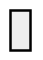
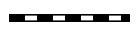
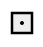

!!! note
    This is correct for only versions of sc-machine that >= 0.9.0.
---

### **Common**

SCs-code - is a text representation of SC-code. Whole text consist of sentences, that
separated by `;;` symbols.

#### **Comments**

You can use C-style comments in sc.s-text:
```scs
// one line comment
fruit -> apple;
/* Multiline
 * comment
 */
```

#### **Link to files**

To make an `sc-link` into specified file you can use special type identifier:
```
"file://<file name>"
```

* `"file://<file name>"` - is a relative path to a file. According to a file, where it used;
* `"file:///<file_name>"` - is an absolute path to a file.

#### **Names**

There are some tricks with sc-node names:

* `...` - is an unnamed sc-node;
* `_<node name>` - all sc-node names, that starts with symbol `_` represents a variable type of sc-nodes.

Objects identifier visibility. By default, all objects with name `x` are visible anywhere. After translating it into memory this object will have a **system identifier** equal to `x`. So if you use `x` in different *scs* files, then you designate the same object in them (would be the same element in a knowledge base).

Sometimes you need to designate the same objects in different files, but do not generate a **system identifier** in memory for it. In this case you should to prefix it name with a `.` symbol. For example: `.x`.

In case, when you need to make a named object just local for an *scs* file, then you should to use `..` prefix (example: `..x`).

So a rule to build identifier is:

```
[visibility][variable]<identifier>
```

For example identifier `.._x` locally visible variable identifier.

#### Aliases

You can use alias for any sc-element by using `=` operator. There are some examples:

```scs
@file_alias = "file://...";;
@link_alias = [];;
@element_alias = element_idtf;;
@arc_alias = (c -> b);;
@alias_to_alias = @element_alias;;
```

!!! warning
    Aliases visible just in a file scope. 
    You should define alias before usage.
 
--- 

!!! note
    SCs-code is split into levels. Each level allows to minimize number of string symbols to represent the same structures.

### **SCs-code level 1**

SCs-code level 1 is a simple representation of SC-code. It represents SC-texts
with just simple triples. Each triple contains `subject`, `predicate`, `object`
that are split by `|` symbol. Line `sc_node#subject_identifier | sc_membership_arc#predicate_identifier | sc_node#object_identifier;;` is a sentence.

Identifier of `subject`, `predicate`, `object` build with rule:

```scs
<type>#<identifier>
```

If object or subject is sc-link, then you should use the next one:

```scs
"file://<file name>"
```

Where `type` is an element type specification. It can be one of possible values:

* `sc_node` - equal to ;
* `sc_link` - equal to ;
* `sc_common_edge` - equal to ;
* `sc_common_arc` - equal to ;
* `sc_membership_arc` - equal to ;
* `sc_main_arc` - equal to .

<hr/>

**Examples**

<table>
  <tr>
    <th>SCg construction</th>
    <th>Equal SCs-code level 1 text</th>
  </tr>

  <tr>
    <td><scg src="../images/scs/scs_example_level_1.gwf"></scg></td>
    <td>
      <pre>
        <code class="js hljs javascript">
// append set of apples into fruit set
sc_node#fruit
  | sc_main_arc#..arc 
  | sc_node#apple;;
// append set of bananas into fruit set
sc_node#fruit
  | sc_main_arc#..arc
  | sc_node#banana;;
        </code>
      </pre>
    </td>
  </tr>

  <tr>
    <td width="50%"><scg src="../images/scs/scs_example_level_1_2.gwf"></scg></td>
    <td>
      <pre>
        <code class="js hljs javascript">
sc_node#apple 
  | sc_common_arc#..common_arc 
  | "file://apple.png";;
/*append sc-arc from nrel_image relation into
  sc-arc between apple set and it's image*/
sc_node_non_role_relation#nrel_image 
  | sc_main_arc#..membership_arc 
  | sc_common_arc#..common_arc;;
        </code>
      </pre>
    </td>
  </tr>
</table>

SCs-code level 1 allows you to represent any kind of SC-code construction. It's a low-level representation and commonly used as a transport format, that is very simple for parsing.

### **SCs-code level 2**

This level of SCs-code add two new features:

* using of extended alphabet of sc-connectors;
* using of compound identifiers of sc-connectors.

On this level you can make sentences by rule:
```
<element> <connector> <element>;;
```

Where `<connector>` can be on of values:

<!-- This table is generated by test `PrintSCsToSCgConnectors` in sc-memory/tests/sc-memory/common/test_sc_type.cpp -->
| SCs-code             | SCg-code                                                               |
|----------------------|------------------------------------------------------------------------|
| ```?<=>```           | Not specified                                                          |
| ```?=> or <=?```     | Not specified                                                          |
| ```?.?> or <?.?```   | Not specified                                                          |
| ```<=>```            | </img>              |
| ```_<=>```           | </img>                |
| ```=> or <=```       | </img>               |
| ```_=> or <=_```     | </img>                 |
| ```??> or <??```     | Not specified                                                          |
| ```_??> or <??_```   | Not specified                                                          |
| ```?-?> or <?-?```   | Not specified                                                          |
| ```?..?> or <?..?``` | Not specified                                                          |
| ```-?> or <?-```     | Not specified                                                          |
| ```_-?> or <?-_```   | Not specified                                                          |
| ```..?> or <?..```   | Not specified                                                          |
| ```_..?> or <?.._``` | Not specified                                                          |
| ```?~?> or <?~?```   | Not specified                                                          |
| ```?%?> or <?%?```   | Not specified                                                          |
| ```~?> or <?~```     | Not specified                                                          |
| ```_~?> or <?~_```   | Not specified                                                          |
| ```%?> or <?%```     | Not specified                                                          |
| ```_%?> or <?%_```   | Not specified                                                          |
| ```??> or <??```     | Not specified                                                          |
| ```??|> or <|??```   | Not specified                                                          |
| ```?/> or </?```     | Not specified                                                          |
| ```.> or <.```       | Not specified                                                          |
| ```_.> or <._```     | Not specified                                                          |
| ```?-> or <-?```     | Not specified                                                          |
| ```?..> or <..?```   | Not specified                                                          |
| ```?~> or <~?```     | Not specified                                                          |
| ```?%> or <%?```     | Not specified                                                          |
| ```-> or <-```       | </img>             |
| ```..> or <..```     | </img>             |
| ```~> or <~```       | Not specified                                                          |
| ```%> or <%```       | Not specified                                                          |
| ```_-> or <-_```     | </img>               |
| ```_..> or <.._```   | </img>               |
| ```_~> or <~_```     | Not specified                                                          |
| ```_%> or <%_```     | Not specified                                                          |
| ```?|> or <|?```     | Not specified                                                          |
| ```_?|> or <|?_```   | Not specified                                                          |
| ```?-|> or <|-?```   | Not specified                                                          |
| ```?..|> or <|..?``` | Not specified                                                          |
| ```?~|> or <|~?```   | Not specified                                                          |
| ```?%|> or <|%?```   | Not specified                                                          |
| ```-|> or <|-```     | </img>             |
| ```..|> or <|..```   | </img>             |
| ```~|> or <|~```     | Not specified                                                          |
| ```%|> or <|%```     | Not specified                                                          |
| ```_-|> or <|-_```   | </img>               |
| ```_..|> or <|.._``` | </img>               |
| ```_~|> or <|~_```   | Not specified                                                          |
| ```_%|> or <|%_```   | Not specified                                                          |
| ```/> or </```       | </img>                  |
| ```_/> or </_```     | </img>                    |

<hr/>

<table>
  <tr>
    <th>SCg construction</th>
    <th>Equal SCs-code level 2 text</th>
  </tr>

  <tr>
    <td><scg src="../images/scs/scs_example_level_1.gwf"></scg></td>
    <td>
      <pre>
        <code class="js hljs javascript">
fruit -> apple;;
// backward direction
banana <- fruit;;
        </code>
      </pre>
    </td>
  </tr>
</table>

<hr/>
Compound identifier of a sc-connector builds as a sentence in SCs-code level 2, but without
`;;` separator and inside brackets `()`: `(<element> <connector> <element>)`.
So that allows to simplify usage of a sc-connector as a source or target of another one.

<hr/>

**Examples**
<table>
  <tr>
    <th>SCg construction</th>
    <th>Equal SCs-code level 2 text</th>
  </tr>

  <tr>
    <td width="50%"><scg src="../images/scs/scs_example_level_1_2.gwf"></scg></td>
    <td>
      <pre>
        <code class="js hljs javascript">
nrel_image -> (fruit => "file://apple.png");;
        </code>
      </pre>
    </td>
  </tr>

  <tr>
    <td><scg src="../images/scs/scs_example_level_2.gwf"></scg></td>
    <td>
      <pre>
        <code class="js hljs javascript">
d -> (c -> (a -> b));;
        </code>
      </pre>
    </td>
  </tr>

  <tr>
    <td><scg src="../images/scs/scs_example_level_2_2.gwf"></scg></td>
    <td>
      <pre>
        <code class="js hljs javascript">
(a -> b) -> (c <- d);;
        </code>
      </pre>
    </td>
  </tr>

</table>

### SCs-code level 3

This level of SCs-code allows to minimize symbols to represent constructions like this one:
<scg src="../images/scs/scs_example_level_3.gwf"></scg>

```scs
c -> (a -> b);;
```

To do that you should use sentence like this:

```scs
<object> <connector> <attribute>: <object>
```

For this example it would be like this:

```scs
a -> c: b;;
```

In case, when outgoing sc-arc from `c` is a variable, then use `::` splitter instead of `:`:

```scs
a -> c:: b;;
```

equal to:

```scs
c _-> (a -> b);;
```

!!! note
    You can use <code>:</code>, <code>::</code> just to replace <code>-></code> or <code>_-></code> sc-arcs.

<hr/>

**Examples**

<table>
  <tr>
    <th>SCg construction</th>
    <th>Equal SCs-code level 3 text</th>
  </tr>

  <tr>
    <td><scg src="../images/scs/scs_example_level_1_2.gwf"></scg></td>
    <td>
      <pre>
        <code class="js hljs javascript">
apple => nrel_image: "file://apple.png";;
        </code>
      </pre>
    </td>
  </tr>

  <tr>
    <td><scg src="../images/scs/scs_example_level_3_2.gwf"></scg></td>
    <td>
      <div class="note">
        <b>Note</b>: it is possible to use any number of <code>:</code>, <code>::</code> in one sentence.
      </div>
      <pre>
        <code class="js hljs javascript">
a <=> c: d:: b;;
        </code>
      </pre>
    </td>
  </tr>
</table>

### **SCs-code level 4**

This level of SCs-code allows to combine many sentences with one element into one.
For that purposes used ';' symbol. So if we have some sentences like:

```scs
x -> y;;
x <- z;;
x => h: r;;
```

Then using SCs level 4 we can write them like this:

```scs
x 
-> y;
<- z;
=> h: r;;
```

In other words, this level of SCs-code allows to use source element one time.

<hr/>

**Examples**

<table>
  <tr>
    <th>SCg-code</th>
    <th>Equal SCs-code level 4 text</th>
  </tr>

  <tr>
    <td><scg src="../images/scs/scs_example_level_1.gwf"></scg></td>
    <td>
      <pre>
        <code class="js hljs javascript">
fruit 
-> apple;
-> banana;;
        </code>
      </pre>
    </td>
  <tr>

  <tr>
    <td><scg src="../images/scs/scs_example_level_4.gwf"></scg></td>
    <td>
      <pre>
        <code class="js hljs javascript">
a
-> c: d: b;
-> e;
-> g: f;;
        </code>
      </pre>
    </td>
  </tr>
</table>

### **SCs-code level 5**

Internal sentences added to SCs-code on this level. They are wrapped by `(* ... *)` brackets.
This type of sentences allow to describe connections of an element inplace.
You can place these internal sentences after `object` element in triple (`subject -> object (* ... *);;`), but before `;;` separator.
You can use level `2-4` sentences inside this one. But there is a just one rule: 

!!! note ""
    You doesn't need to specify start element for each sentence. Because object (for which internal sentence builds) 
    is going to be a subject for all internal sentences 

Look at the examples, to understand how it works:


<table>
  <tr>
    <th>SCs-code level 2-4</th>
    <th>SCs-code level 5</th>
    <th>Description</th>
  </tr>
  
  <tr>
    <td>
      <pre>
        <code class="js hljs javascript">
set -> attr: item;;
item -> subitem;;
          </code>
        </pre>
    </td>
    <td>
      <pre>
        <code class="js hljs javascript">
set
-> attr: item 
(*
  -> subitem;;
*);;
        </code>
      </pre>
    </td>
    <td>
    This is a simple example, that allow to make an sc.s-text more readable and useful. In this case text has a sublevels, that allows
    to read it faster.
    </td>
  </tr>

  <tr>
    <td>
      <pre>
        <code class="js hljs javascript">
set -> attr: item;;
item -> subitem;;
item -> attr2: subitem2;;
        </code>
      </pre>
    </td>
    <td>
      <pre>
        <code class="js hljs javascript">
set 
-> attr: item
(* 
  -> subitem;;
  -> attr2: subitem2;;
*);;
        </code>
      </pre>
    </td>
    <td>
    You can use as much as you need sentences in <code>(* *)</code>, but all of them should be separated by <code>;;</code>.
    </td>
  </tr>

  <tr>
    <td>
      <pre>
        <code class="js hljs javascript">
@en_idtf = [sc-element];;
@ru_idtf = [sc-элемент];;
@en_idtf <- lang_en;;
@ru_idtf <- lang_ru;;
sc_element 
=> nrel_main_idtf: 
  @en_idtf;
  @ru_idtf;;
        </code>
      </pre>
    </td>
    <td>
      <pre>
        <code class="js hljs javascript">
sc_element
=> nrel_main_idtf:
  [sc-element]
  (* <- lang_en;; *);
=> nrel_main_idtf:
  [sc-элемент]
  (* <- lang_ru;; *);;
        </code>
      </pre>
    </td>
    <td>
    This type of syntax is very useful, when you need to specify some meta information on <code>sc-link</code>'s.
    In this example we specify two main identifiers for a <code>sc_element</code>. One is an english (<code>lang_en</code>) identifier,
    another one is a russian (<code>lang_ru</code>).
    </td>
  </tr>
  
</table>

### **SCs-code level 6**

There are some new complex aliases, that adds by this level of SCs-code:

* `[...]` - this is a short representation of `sc-link` with a content. You can create `sc-link` with a specified content
by using this feature. There are all possible cases:
<table>
  <tr>
    <th>Type</th>
    <th>Description</th>
    <th>Example</th>
  </tr>
    <tr>
      <td>`string`</td>
      <td>You can write any string that you wish inside <code>[ ... ]</code> alias</td>
      <td>
        <pre>
          <code class="js hljs javascript">
x -> [any string];;
x -> [this is a 
 multiline text];;
          </code>
        </pre>
      </td>
    </tr>
    <tr>
      <td>`number`</td>
      <td>You can specify a number as a binary data. To do that, just use syntax:
        <code>[^"type: value"]</code>. Where <code>type</code> is a one of possible types:
        <ul> 
          <li><code>int</code> - signed integer value (32 bit). You can also use such types for an integer:
            <code>int8</code>, <code>int16</code>, <code>int32</code>, <code>int64</code>
          </li>
          <li><code>uint</code> - unsigned integer value (32 bit). You can also use such type for an unsigned integer:
            <code>uint8</code>, <code>uint16</code>, <code>uint32</code>, <code>uint64</code>
          </li>
          <li><code>float</code> - 32-bit float value</li>
          <li><code>double</code> - 64-bit float value</li>
        </ul>
      </td>
      <td>
        <pre><code class="js hljs javascript">
x -> [^"float: 435.2346"];;
x -> [^"int8: 7"];;
x -> [^"uint: 781236"];;
        </code></pre>
      </td>
    </tr>
</table>

* `[* ... *]` this is a short representation of <code>sc-structure</code>. You can use just sc.s-text inside these brackets.
  So these brackets will designate an <code>sc-structure</code> (<code>sc-node</code> with a type <code>sc_node_structure</code>). All elements inside
  brackets will have incoming sc-arc (type <code>sc_main_arc</code>) from that <code>sc-node</code>.
  <table>
    <tr>
      <th>SCs-code level 2-5</th>
      <th>SCs-code level 6</th>
    </tr>

    <tr>
      <td>
        <pre><code class="js hljs javascript">
@arc_alias = (set -> item);;
structure -> set; item; @arc_alias;;
        </code></pre>
      </td>
      <td>
        <pre>
          <code class="js hljs javascript">
@structure = [* set -> item;; *];;
          </code>
        </pre>
      </td>
    </tr>
  </table>

!!! important "That's important"
    Sс.s-text inside `[* ... *]` has the same rules and semantic, like it will be in a separated file

* `{ ... }` is a short representation of non-oriented set. This feature allow to make sets in very fast way.
  Syntax looks like:
  
  ```scs
  @non_oriented_set = {
    element1;
    attr2: element2;
    ...
    last_element // no semicolon after last element
  };;
  ```

* `< ... >` is a short representation of oriented set. This feature allow to make sets in very fast way.
  Syntax looks like:

  ```scs
  @oriented_set = <
    element1;
    attr2: element2;
    ...
    last_element // no semicolon after last element
  >;;
  ```

<table>
  <tr>
    <th>SCs-code level 2-5</th>
    <th>SCs-code level 6</th>
    <th>Comments</th>
  </tr>

  <tr>
    <td>
      <pre>
        <code class="js hljs javascript">
set
<- sc_node_tuple;
-> element1;
-> attr2: element2;
-> element3;;
        </code>
      </pre>
    </td>
    <td>
      <pre>
        <code class="js hljs javascript">
@set = {
  element1;
  attr2: element2;
  element3 // no semicolon
};;
        </code>
      </pre>
    </td>
    <td>Using set looks much cleaner. You can use even attributes on it.</td>
  </tr>
  
  <tr>
    <td>
      <pre>
        <code class="js hljs javascript">
meta_set 
<- sc_node_tuple;
-> set1;
-> set2;;

set1
<- sc_node_tuple;
-> element1;
-> attr2: element2;
-> element3;;

set2
<- sc_node_tuple;
-> element5;
-> element6;;

set3
<- sc_node_tuple;
-> element10;;

element 
=> nrel_relation: set3;;
        </code>
      </pre>
    </td>
    <td>
      <pre>
        <code class="js hljs javascript">
@meta_set = {
  {
    element1;
    attr2: element2;
    element3
  };
  {
    element5;
    element6
  }
};;

element 
=> nrel_relation:
{
  element10
};;
        </code>
      </pre>
    </td>
    <td>You can use set alias inside any other complex aliases and triples.</td>
  </tr>

  <tr>
    <td>
      <pre>
        <code class="js hljs javascript">
set
<- sc_node_tuple;;

@first_arc = (set -> rrel_1: element1);;
@second_arc = (set -> element2);;

nrel_basic_sequence
-> (@first_arc => @second_arc);;
        </code>
      </pre>
    </td>
    <td>
      <pre>
        <code class="js hljs javascript">
@set = <
  element1;
  element2 // no semicolon
>;;
        </code>
      </pre>
    </td>
    <td>Using set looks much cleaner. You can use even attributes on it.</td>
  </tr>
</table>


### **Keynodes**

There are a list of element type keynodes, that can be used to specify type of sc-element:

| Keynode                   | Equal sc-type                  | Possible sc.g-elements                                                                                            |
|---------------------------|--------------------------------|-------------------------------------------------------------------------------------------------------------------|
| sc_node                   | ScType::Node                   |                         |
| sc_link                   | ScType::ConstNodeLink          |               |
| sc_common_edge            | ScType::ConstCommonEdge        |                                                                    |
| sc_common_arc             | ScType::ConstCommonArc         |                                                                     |
| sc_membership_arc         | ScType::MembershipArc          |                                                                 |
| sc_main_arc               | ScType::ConstPermPosArc        |                                                             |
| sc_node_tuple             | ScType::NodeTuple              |             |
| sc_node_structure         | ScType::NodeStructure          |     |
| sc_node_role_relation     | ScType::NodeRole               |               |
| sc_node_non_role_relation | ScType::NodeNonRole            |       |
| sc_node_class             | ScType::NodeClass              |             |
| sc_node_superclass        | ScType::NodeSuperclass         | Not specified                                                                                                     |
| sc_node_material          | ScType::NodeMaterial           |       |

There is an example of usage:

<table>
  <tr>
    <th>SCs-code</th>
    <th>Equal SCg-code</th>
  </tr>
  <tr>
    <td>
      <pre>
a <- sc_node_class;;
a _-> _b;;
_b <- sc_node_material;;
      </pre>
    </td>
    <td><scg src="../images/scs_keynodes_old_example_1.gwf"></scg></td>
  </tr>
  <tr>
    <td>
      <pre>
_x => nrel_y: t;;
nrel_y <- sc_node_non_role_relation;;
      </pre>
    </td>
    <td><scg src="../images/scs_keynodes_old_example_2.gwf"></scg></td>
  </tr>
</table>

## **Frequently Asked Questions**

<!-- no toc -->
- [**What SCs-code level is recommended to use?**](#what-scs-code-level-is-recommended-to-use)
- [**Can I combine different levels in one SCs file?**](#can-i-combine-different-levels-in-one-scs-file)
- [**What is the difference between ```set -> a; -> b; -> c;;``` and ```set -> a; b; c;;```?**](#what-is-the-difference-between-set-a-b-c-and-set-a-b-c)

### **What SCs-code level is recommended to use?**

The first levels of SCs-code have minimal syntax, so it is simple to handle sc.s-text of these levels. But the last levels of
SCs-code allow you to make sc.s-text more compact, but these levels of SCs-code have more complicated syntax.

### **Can I combine different levels in one SCs file?**

All levels of SCs-code can be combined. Usually it is useful to use 4-6 levels if you use 2-3 levels.

### **What is the difference between ```set -> a; -> b; -> c;;``` and ```set -> a; b; c;;```?**

These sc.s-texts are identical. The second sc.s-text is just short version of the first sc.s-text, it allows to not duplicate sc.s-connectors between sc.s-elements.
