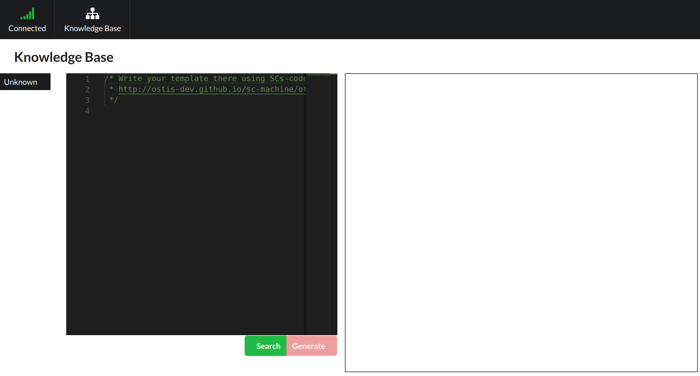

# Web interface

## Build

```
cd web/client
yarn && yarn run webpack-dev
```

## Run

- Run `sc-server` example command:

```
sc-server -r kb.bin -e extensions -i config.ini -c
```

- Open URL [http://localhost:8090/](http://localhost:8090/) in web browser:



## Usage

In current version you can run just only template search.
Use SCs-text to specify search template.